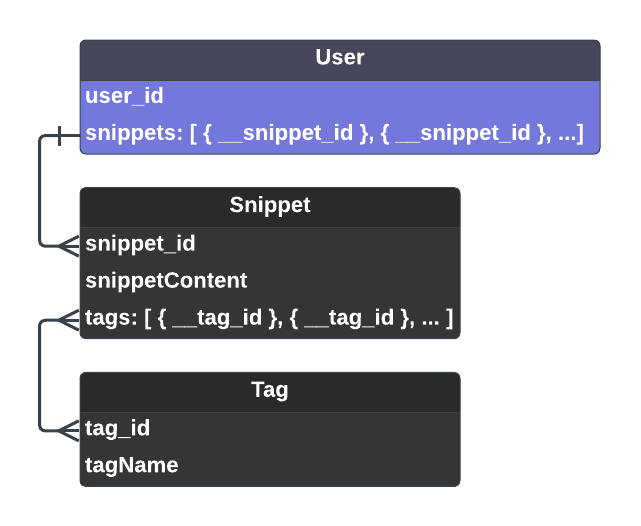

# Snippetag

Snippetag empowers you to save, organize, and flexibly retrieve text using tags. Users can upload text snippets, tag them, and retrieve text according to its associated tags. 

## MVP Features

#### USERS & AUTHENTICATION:
* Securely log in with Google OAuth.
* All create/update/delete interactions between the user and database models will be secured using middleware.
* App creates a basic User Profile for each user, including: username/email (from Google)

#### UPLOAD & TAGGING:
* Upload form for text ‘snippets’
* Tag update interface to edit the tags associated with a given snippet; option to delete snippet

#### SEARCH & RETRIEVAL:
* Search interface which displays a list of all snippets associated with a tag

## MVP User Stories

#### USERS & AUTHENTICATION:
* AAU I can securely log in using Google OAuth.
* AAU I can delete my User Profile

#### UPLOAD & TAGGING:
* AAU I can upload text ‘snippets’ and add ‘tags’ to the snippet from a preset list
* AAU I can edit the tags associated with a given snippet
* AAU I can delete a snippet

#### SEARCH & RETRIEVAL:
* AAU I can view a user-friendly list of all snippets associated with each tag

## Entity Relationship Diagram (ERD)

## RESTful Routing Table
| HTTP Method | URL                                 | CRUD   | Response             | Notes                                       |
| ----------- | ----------------------------------- | ------ | -------------------- | ------------------------------------------- |
| GET         | /                                   | INDEX  |                      | Login/landing page                          |
| GET         | /profile                     | SHOW   | { user }             | User homepage                               |
| GET         | /snippets/new                     | GET   | { tagYearOptions, tagSectionOptions, tagClientOptions, displayMessage } | Upload Snippets Page|
| POST        | /snippets             | CREATE |  | Create/upload a snippet of text with associated tags             |
| GET         | /snippets/edit | GET   | { snippets, tagAllOptions, userUniqueTags, displayMessage } | Edit Snippets Page|
| POST        | /snippets/:snippet_id   | CREATE |  | Associate another tag with a snippet (after upload)|
| DELETE   | /snippets/:snippet_id/remove-tag | DELETE | | Remove tags associated with a snippet  |
| DELETE      | /snippets             | DELETE |                      | Delete a snippet                            |
| GET         | /snippets/edit/search                 | INDEX  | { tag }              | Retrieve all snippets associated with a tag |

## Wirerames

 
 

 
 

 
 

 
 

## Technology Stack
Snippetag is a Node.js app built using the Express framework. 
* **Database:** The app is connected to a MongoDB database in the Atlast cloud. Mongoose handles Database object modeling. 
* **Authentication:** Users are authenticated with Google OAuth2 using Passport middleware.
* **UI:** EJS templating assists with some UI elements.   

## Next Steps

#### USERS & AUTHENTICATION
  * User avatar picture appears in the nav bar while the user is logged in
  * User homepage includes username and email info

#### UPLOAD
* Uploads preserve some text formatting (e.g. tables within text will remain formatted as tables)

#### TAGGING
  * Users can create custom tags which will be available to tag any text snippets associated with their user
  * Within the text entered into the form, users can select character strings (characters/words/sentences) and add tags to the specific selection
  * Users can create a two-layer tag hierarchy, i.e. tags-within-tags. For example: month: ‘January’ contained within year: ‘2019’; ‘lodging’ within ‘budget’.

#### SEARCH & RETRIEVAL:
* Users can filter & search snippets by tag while editing snippet tags
* Users can view a user-friendly list of all snippets associated with two or more tags chosen by the user
* Users can Advanced Search using boolean chains with one or more tags, e.g. ‘Tagged with’ & ‘NOT Tagged with’
* Users can save their search configurations to their user profile and use a button to re-do the search as-desired.
* Users can use a pivot-table interface to parse and filter tagged content.
 
