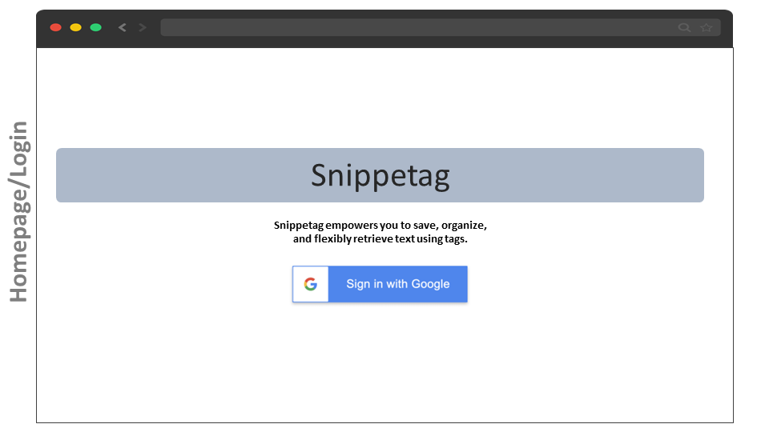
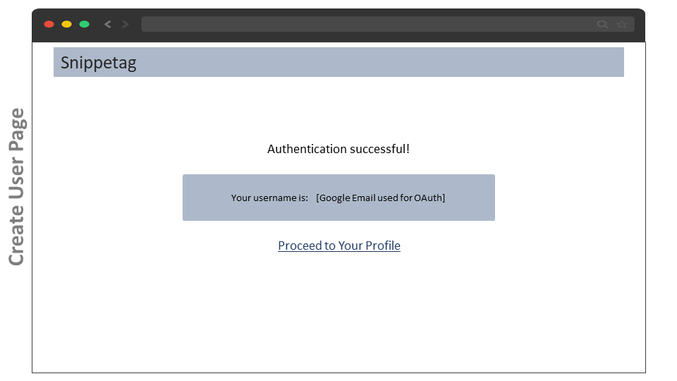
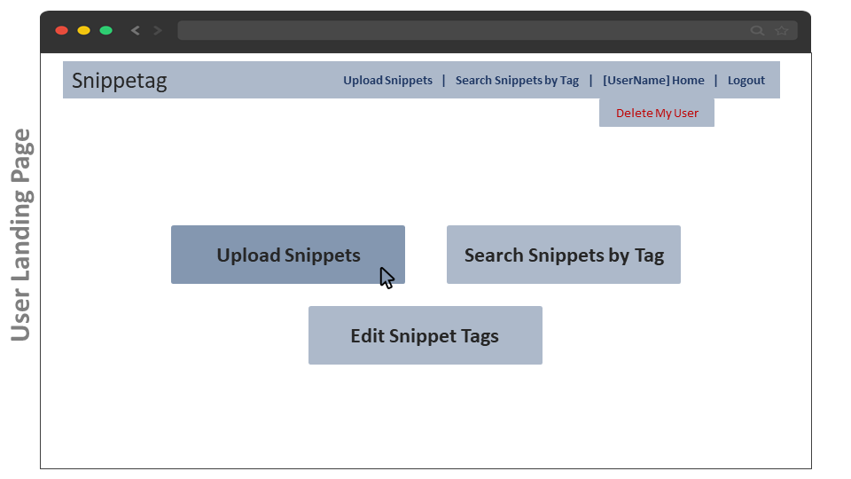
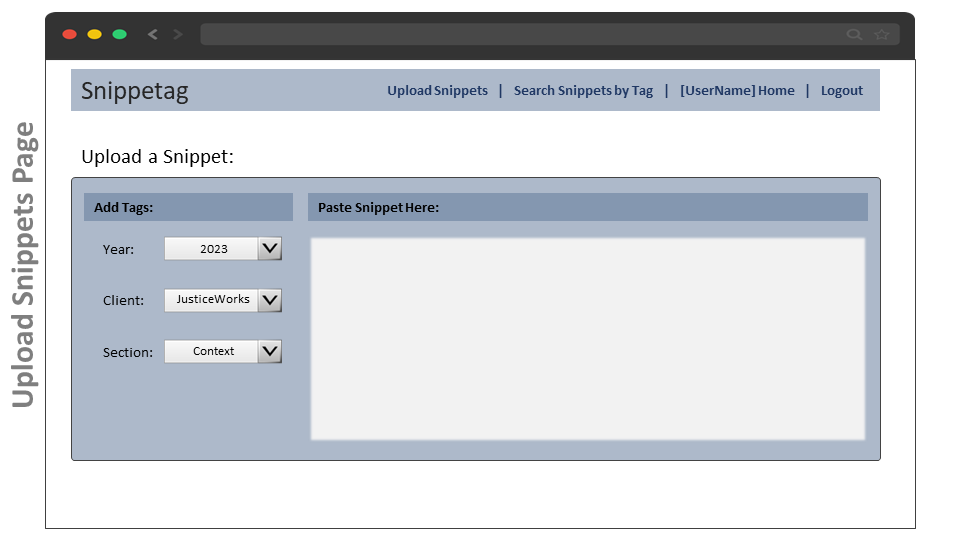
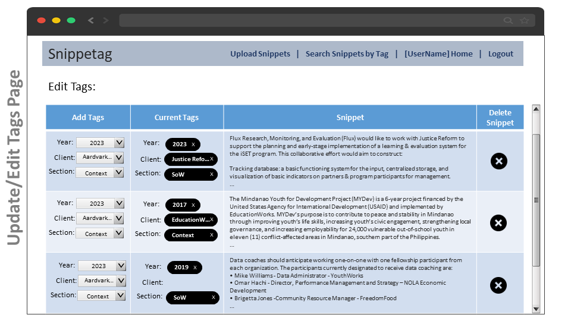
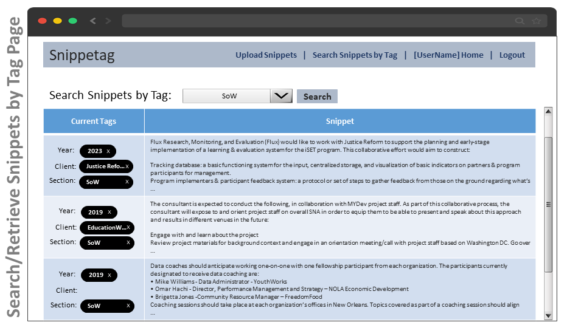

# Snippetag

Snippetag empowers you to save, organize, and flexibly retrieve text using tags. Users can upload text snippets, tag them, and retrieve text according to its associated tags. 

## MVP Features

#### USERS & AUTHENTICATION:
* Securely log in with Google OAuth.
* All create/update/delete interactions between the user and database models will be secured using middleware.
* App creates a basic User Profile for each user, including: username/email (from Google)

#### UPLOAD & TAGGING:
* Upload form for text ‘snippets’
* Tag update interface to edit the tags associated with a given snippet; option to delete snippet

#### SEARCH & RETRIEVAL:
* Search interface which displays a list of all snippets associated with a tag

## MVP User Stories

#### USERS & AUTHENTICATION:
* AAU I can securely log in using Google OAuth.
* AAU I can delete my User Profile

#### UPLOAD & TAGGING:
* AAU I can upload text ‘snippets’ and add ‘tags’ to the snippet from a preset list
* AAU I can edit the tags associated with a given snippet
* AAU I can delete a snippet

#### SEARCH & RETRIEVAL:
* AAU I can view a user-friendly list of all snippets associated with each tag

## Entity Relationship Diagram (ERD)

## RESTful Routing Table
| HTTP Method | URL                                 | CRUD   | Response             | Notes                                       |
| ----------- | ----------------------------------- | ------ | -------------------- | ------------------------------------------- |
| GET         | /                                   | INDEX  |                      | Login/landing page                          |
| POST        | /users                              | CREATE | { user }             | Create new user                             |
| DELETE      | /users                              | DELETE |                      | Delete user                                 |
| GET         | /users/:user_id                     | SHOW   | { user }             | User homepage                               |
| POST        | /user/:user_id/snippets             | CREATE | { snippet { tags } } | Create/upload a snippet of text             |
| PUT/PATCH   | /user/:user_id/snippets/:snippet_id | UPDATE | { tags }             | Update/edit tags associated with a snippet  |
| DELETE      | /user/:user_id/snippets             | DELETE |                      | Delete a snippet                            |
| GET         | /user/:user_id/tags                 | INDEX  | { tag }              | Retrieve all snippets associated with a tag |

## Wirerames

 
 

 
 

 
 

 
 

 
 

## Stretch Goals

#### USERS & AUTHENTICATION
* **Stretch:** 
  * Add an avatar picture

#### UPLOAD & TAGGING
* **Stretch:** 
  * Users can create custom tags which will be available to tag any document associated with their user.
  * Within the text entered into the form, users can select character strings (characters/words/sentences) and add tags to the specific selection
  * Users can filter & search snippets by tag while editing snippet tags
  * Users can create a two-layer tag hierarchy, i.e. tags-within-tags. For example: month: ‘January’ contained within year: ‘2019’; ‘lodging’ within ‘budget’.
* **Extra-Stretch:**
  * Users can create a two-layer tag hierarchy, i.e. tags-within-tags. For example: month: ‘January’ contained within year: ‘2019’; ‘lodging’ within ‘budget’.  
* **Stretch Armstrong:**
  * Uploads preserve some text formatting
  * Users can upload tables within text and table will be displayed as a table

#### SEARCH & RETRIEVAL:
* **Stretch:** 
  * Users can view a user-friendly list of all snippets associated with two or more tags chosen by the user
* **Extra-Stretch:**
  * Users can Advanced Search using boolean chains with one or more tags, e.g. ‘Tagged with’ & ‘NOT Tagged with’
  * Users can save their search configurations to their user profile and use a button to re-do the search as-desired.
* **Stretch Armstrong:**
  * Users can use a pivot-table interface to parse and filter tagged content.
  * Users can create Documents 
    * Users can select single snippets and associate them with a Document (building custom docs from snippets). 
    * A user’s documents will be available for both view and ‘download to hard drive’ from their user profile.
 
